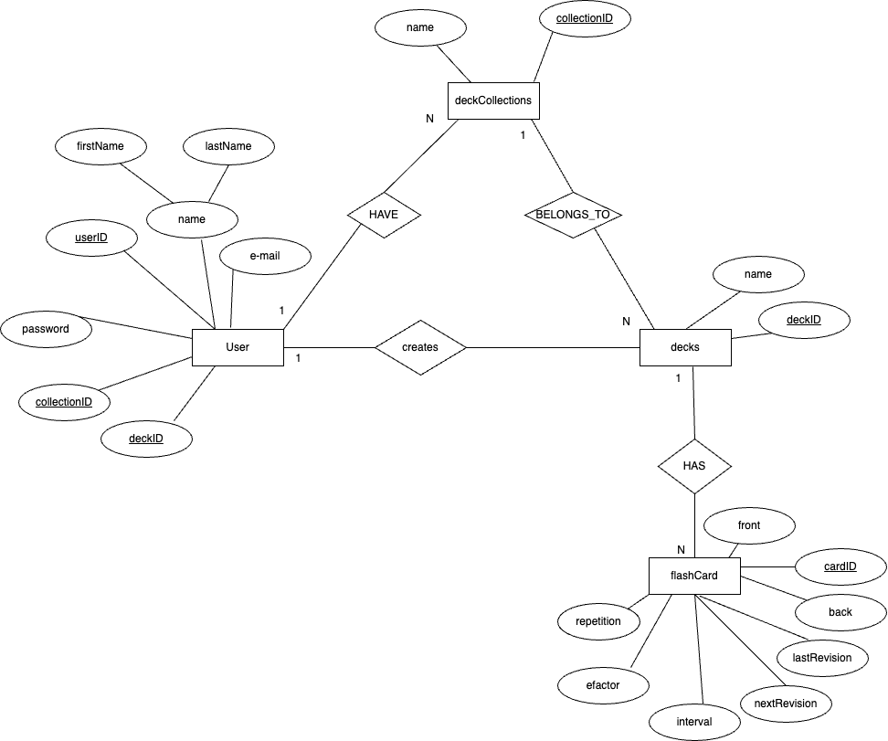
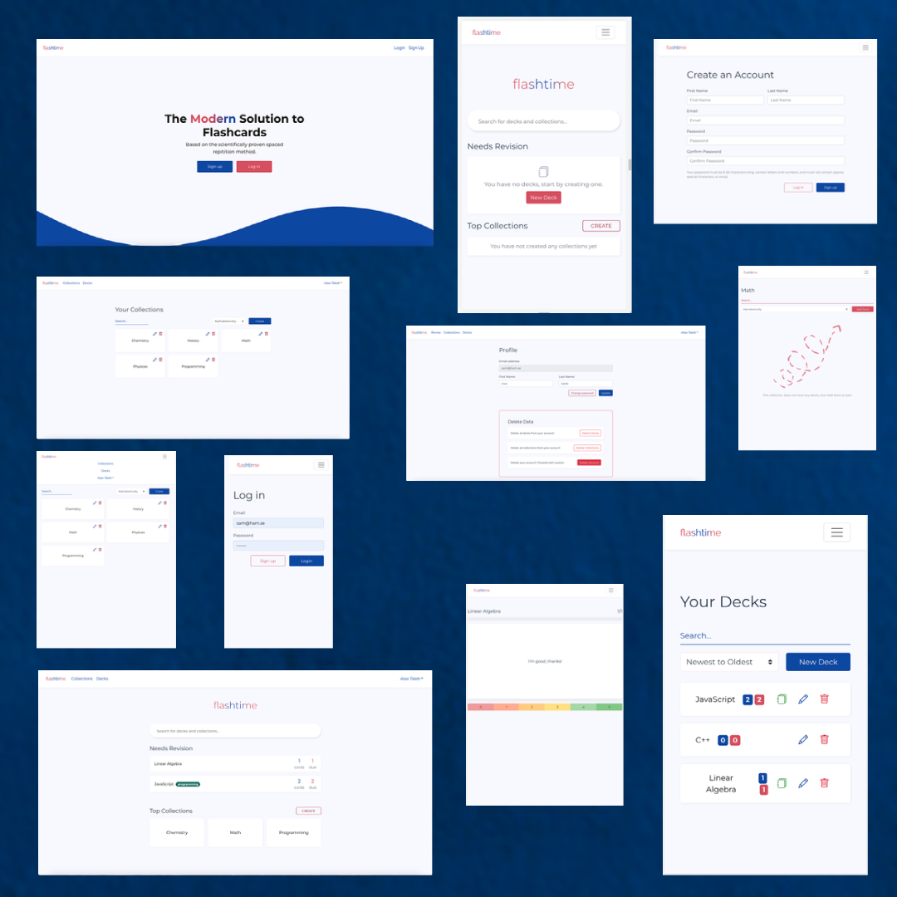

# Backend and Frontend Template

Latest version: https://git.ita.chalmers.se/courses/dit341/group-00-web (public Github [mirror](https://github.com/dit341/group-00-web))

## Project Structure

| File                                                 | Purpose                           | What you do?                              |
| ---------------------------------------------------- | --------------------------------- | ----------------------------------------- |
| `server/`                                            | Backend server code               | All your server code                      |
| [server/README.md](server/README.md)                 | Everything about the server       | **READ ME** carefully!                    |
| `client/`                                            | Frontend client code              | All your client code                      |
| [client/README.md](client/README.md)                 | Everything about the client       | **READ ME** carefully!                    |
| [docs/DEPLOYMENT.md](docs/DEPLOYMENT.md)             | Free online production deployment | Deploy your app online in production mode |
| [docs/LOCAL_DEPLOYMENT.md](docs/LOCAL_DEPLOYMENT.md) | Local production deployment       | Deploy your app local in production mode  |

## Requirements

The version numbers in brackets indicate the tested versions but feel free to use more recent versions.
You can also use alternative tools if you know how to configure them (e.g., Firefox instead of Chrome).

- [Git](https://git-scm.com/) (v2) => [installation instructions](https://www.atlassian.com/git/tutorials/install-git)
  - [Add your Git username and set your email](https://docs.gitlab.com/ce/gitlab-basics/start-using-git.html#add-your-git-username-and-set-your-email)
    - `git config --global user.name "YOUR_USERNAME"` => check `git config --global user.name`
    - `git config --global user.email "email@example.com"` => check `git config --global user.email`
  - > **Windows users**: We recommend to use the [Git Bash](https://www.atlassian.com/git/tutorials/git-bash) shell from your Git installation or the Bash shell from the [Windows Subsystem for Linux](https://docs.microsoft.com/en-us/windows/wsl/install-win10) to run all shell commands for this project.
- [Chalmers GitLab](https://git.ita.chalmers.se/) => Login with your **Chalmers CID** choosing "Sign in with" **Chalmers Login**. (contact [support@chalmers.se](mailto:support@chalmers.se) if you don't have one)
  - DIT341 course group: https://git.ita.chalmers.se/courses/dit341
  - [Setup SSH key with Gitlab](https://docs.gitlab.com/ee/ssh/)
    - Create an SSH key pair `ssh-keygen -t ed25519 -C "email@example.com"` (skip if you already have one)
    - Add your public SSH key to your Gitlab profile under https://git.ita.chalmers.se/profile/keys
    - Make sure the email you use to commit is registered under https://git.ita.chalmers.se/profile/emails
  - Checkout the [Backend-Frontend](https://git.ita.chalmers.se/courses/dit341/group-00-web) template `git clone git@git.ita.chalmers.se:courses/dit341/group-00-web.git`
- [Server Requirements](./server/README.md#Requirements)
- [Client Requirements](./client/README.md#Requirements)

## Getting started

```bash
# Clone repository
git clone git@git.ita.chalmers.se:courses/dit341/group-00-web.git

# Change into the directory
cd group-00-web

# Setup backend
cd server && npm install
npm run dev

# Setup frontend
cd client && npm install
npm run serve
```

> Check out the detailed instructions for [backend](./server/README.md) and [frontend](./client/README.md).

## Visual Studio Code (VSCode)

Open the `server` and `client` in separate VSCode workspaces or open the combined [backend-frontend.code-workspace](./backend-frontend.code-workspace). Otherwise, workspace-specific settings don't work properly.

## System Definition (MS0)

### Purpose

The main purpose is to enhance the learning experience of the website's users by offering a learning tracker service that enables users to create or chose a deck collection of a certain learning topic. Therefore the user will be able to revise (using the scientifically proven spaced-reptition method) and repeat what the user has learned by answering flashcard questions, hence getting an estimation when they need to revisit the topic based on how they did on the last revision. For further information on Spaced repetition refer to https://en.wikipedia.org/wiki/Spaced_repetition.

### Pages

- **Home:** where users can read about the website, can sign up and Login.
- **Login:** Where the user type their username and password to get accesise to their dashboard.
- **Signup:** The user can enter their details and sign up for an account.
- **Dashboard:** This is the logged in area where the user can see/manage their cards(which needs to be revise), collections. There is a search bar where user can search for specific collection or decks.
- **Revise page:** This is the page where the user performs their revisions based on the aforementioned algorithm.
- **Revision page:** Where user can see all of their decks that include cards that needs to be revised.
- **Collection page:** This is the page where user can see all the collections. User can sort the collection alphabetically, newest to oldest and oldest to newest, as well as user can serach for specific collection. In addition user can delete, edit and create the collection.
- **Deck page:** This is the page where user can see all the decks. User can sort decks alphabetically, newest to oldest, oldest to newest and by number of cards, as well as user can serach for specific deck. In addition user can delete, edit, revise and create the deck.
- **Card page:** This is the page where user can see all the cards. User can serach for specific card. In addition user can delete, edit, and create the card.
- **Profile page:** This is the page where user can change their firstname and lastname. In addition user can delete all their decks, collections as well as their account.
- **Change password:** Where users are able to change their password.

### Entity-Relationship (ER) Diagram



## Teaser (MS3)


